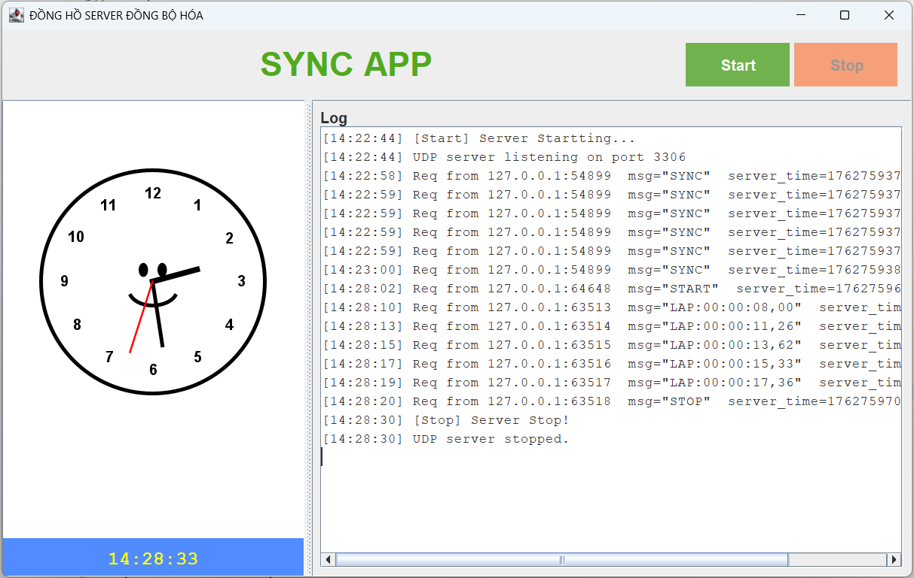
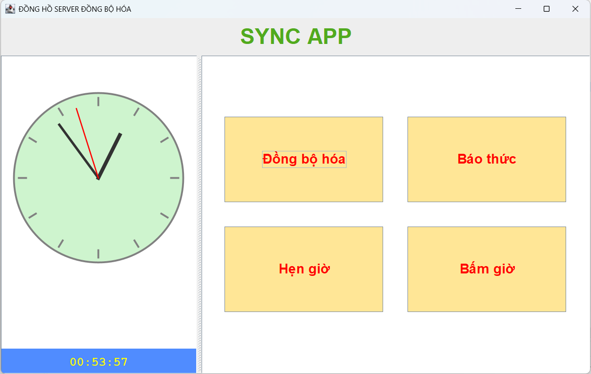
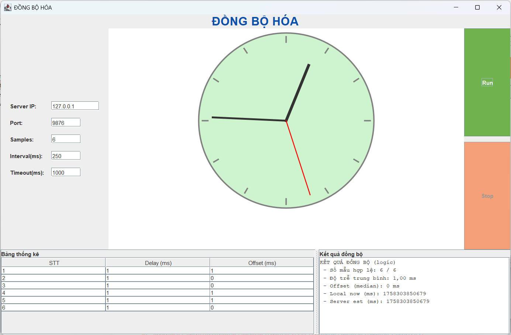
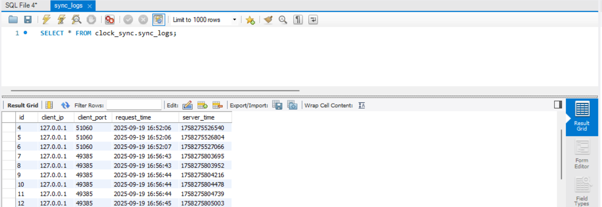
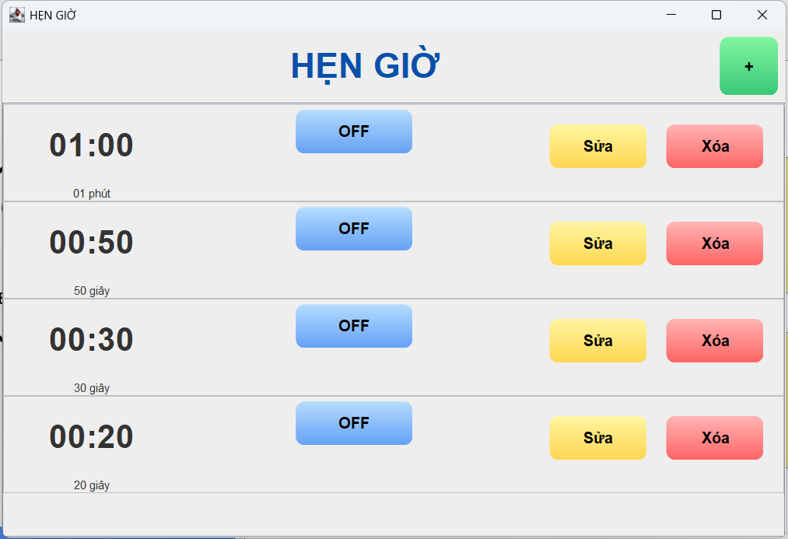
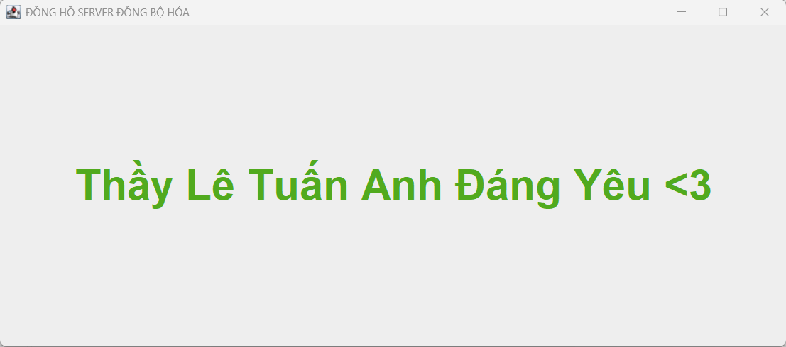
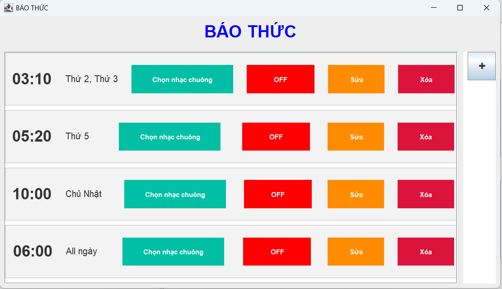
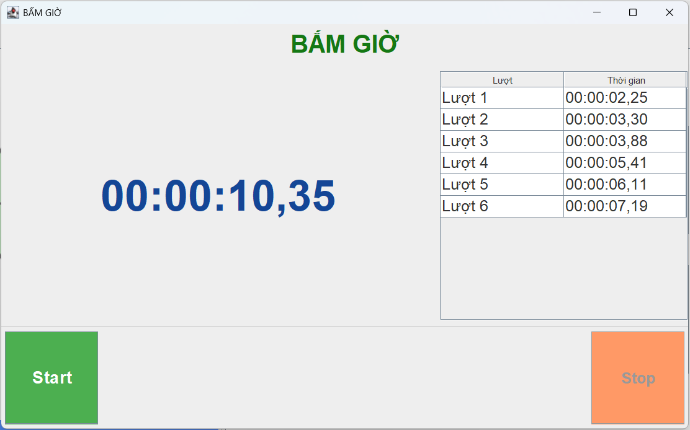

<h2 align="center">
    <a href="https://dainam.edu.vn/vi/khoa-cong-nghe-thong-tin">
    🎓 Faculty of Information Technology (DaiNam University)
    </a>
</h2>
<h2 align="center">
   Đồng hồ Server – Client (đồng bộ thời gian)
</h2>

    

        
        
        
    

## 📖 1. Giới thiệu hệ thống 

📌 Đây là một ứng dụng Java mô phỏng hệ thống đồng hồ đồng bộ thời gian. Ngoài ra, còn có các chức năng như báo thức (Alarm), hẹn  và đồng hồ bấm giờ (Stopwatch), kèm theo chức năng Client-Server để trao đổi dữ liệu qua giao thức TCP.

📌 Ứng dụng được xây dựng với giao diện đồ họa (Java Swing) nhằm giúp người dùng quản lý thời gian và kiểm thử chức năng truyền thông mạng.
    
📌 Bên cạnh đó, dữ liệu có thể được lưu trữ và truy xuất qua cơ sở dữ liệu MySQL để đảm bảo tính bền vững.

🖥️ ServerApp (Server):

👉 Khởi tạo socket server để lắng nghe các kết nối từ client.

👉 Xử lý yêu cầu từ client như gửi/nhận dữ liệu báo thức, đồng hồ, hoặc thông tin khác.

👉 Quản lý kết nối nhiều client đồng thời.

👉 Kết nối và giao tiếp với cơ sở dữ liệu MySQL để lưu trữ hoặc truy xuất thông tin.

🖥️ ClientApp (Client):

👉 Kết nối đến server thông qua địa chỉ IP và cổng TCP.

👉 Gửi yêu cầu (vd: tạo báo thức, xem danh sách báo thức, gửi kết quả stopwatch).

👉 Nhận phản hồi và hiển thị dữ liệu từ server cho người dùng.

👉 Đóng vai trò là cầu nối giữa người dùng và server.

🖥️ Database (MySQL):

👉 Lưu trữ thông tin báo thức của người dùng.

👉 Lưu lại lịch sử sử dụng stopwatch nếu cần.

👉 Đảm bảo dữ liệu được lưu lâu dài, có thể tái sử dụng sau khi tắt ứng dụng.

## 2. Công nghệ sử dụng

 

  
 
 
 
 

## 3. Một số hình ảnh của hệ thống

 🖥️ Giao diện Server

🖥️ Giao diện Client

🔄 Giao diện đồng hồ Đồng bộ hóa  

📊 Bảng dữ liệu trong MySQL (sync_log)

⏱️ Giao diện đồng hồ hẹn giờ  

👥 Giao diện khi hẹn giờ xong  

⏰ Giao diện đồng hồ báo thức  

🕒 Giao diện đồng hồ bấm giờ  

## 4. Các bước cài đặt
🔧 Bước 1. Chuẩn bị môi trường

    Cài đặt JDK 8 hoặc 11.

    Cài đặt MySQL 8.x + Workbench.

    Tạo database clock_sync
🗄️ Bước 2. Tạo bảng trong MySQL

📦 Bước 3. Thêm thư viện JDBC

    Tải mysql-connector-j-9.4.0.jar.

    Copy vào thư mục lib/ của project → Add to Build Path.
⚙️ Bước 4. Cấu hình kết nối

    Trong Database:

    private void startServer() {
     appendLog("[Start] Server Startting...");
     int port = 9876; 
     // DB params - hãy chỉnh theo máy bạn
     String url = "jdbc:mysql://localhost:3306/clock_sync?useSSL=false&serverTimezone=UTC";
     String user = "root";
     String pass = "my_password";

     server = new UDPServer(port, url, user, pass, this::appendLog);
     server.start();
     btnStart.setEnabled(false);
     btnStop.setEnabled(true);
    }

▶️ Bước 5. Chạy hệ thống

👉  Chạy ServerApp.java → nhấn Start Server.

👉  Chạy ClientApp.java → nhấn Đồng bộ hóa → nhấn Run.

👉  Quan sát Bảng kết quả đồng bộ, Bảng thống kê, Đồng hồ.

👉  Kiểm tra dữ liệu trong MySQL Workbench:
        SELECT * FROM clock_sync ORDER BY id DESC;
        
👉  Ở giao diện ClientApp → nhấn Báo thức / Hẹn Giờ / Bấm giờ      

## 5. Contact me

    Nguyễn Minh Đức CNTT 16-01

    Khoa: Công nghệ thông tin - Trường Đại học Đại Nam 

    SĐT: 0372334278

    Email: duc1608204@gmail.com

    
